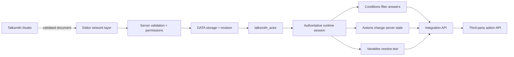
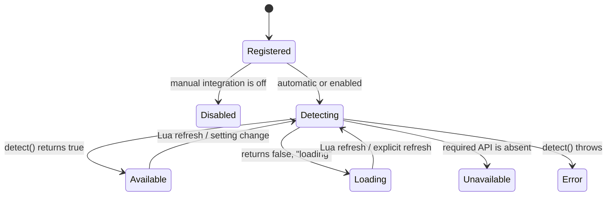

# Talksmith Developer Guide

> Architecture, runtime flow, extension points, and integration development for Talksmith 2.0.0.

[Русская версия](developer-guide.ru.md) · API version: `2.0.0` · Integration API: `1` · Dialogue schema: `3`

## 1. What Talksmith is

Talksmith is a server-authoritative NPC dialogue framework for Garry's Mod. Authors build dialogue graphs in Talksmith Studio, attach one graph to a `talksmith_actor`, and extend dialogue logic through registered conditions, actions, variables, and providers.

The central design rule is simple:

> Dialogue documents contain identifiers and scalar parameters, never executable Lua. The server resolves those identifiers through trusted registries and validates every selection again before executing anything.

This separation gives the editor a friendly data model while keeping rewards, inventory changes, permissions, and world automation on the server.

## 2. Architecture at a glance



### Core responsibilities

| Area | Responsibility |
| --- | --- |
| `Talksmith.Dialogues` | Dialogue schema, registry, import/export, revisions, and persistence |
| `Talksmith.Validation` | Document and parameter validation |
| `Talksmith.Runtime` | Sessions, transitions, visible answers, actions, and termination |
| `Talksmith.Actors` | Creation, appearance, persistence, and dialogue assignment |
| `Talksmith.Actions` | Trusted server action registry |
| `Talksmith.Conditions` | Trusted server condition registry |
| `Talksmith.Integrations` | Manifests, availability, variables, and integration lifecycle |
| `Talksmith.Providers` | Common inventory and currency adapters |
| `Talksmith.Editor` | Studio UI, graph editing, preview, validation, and settings |
| `Talksmith.Permissions` | Editing, publishing, Actor, settings, and action privileges |
| `Talksmith.Logging` | Server diagnostics and optional Ultimate Logs output |
| `Talksmith.Utils` | Safe IDs, UTF-8-aware text limits, map/model checks, and protected calls |

## 3. Source layout and load model

The addon entry point is:

```text
talksmith_dialogue_addon_dev_name/lua/autorun/talksmith_init.lua
```

It creates the single global namespace `Talksmith`, sets API versions, and loads modules in three groups:

| Group | Runs on | Typical content |
| --- | --- | --- |
| Shared | Server and client | config, schema, validation, registries, i18n, API declarations |
| Server | Server only | storage, permissions, sessions, Actors, network handlers, integrations |
| Client | Client only | runtime HUD, Studio, settings, preview, editor networking |

Use `local TS = Talksmith` inside addon modules. Third-party integrations should check `Talksmith.API.IntegrationVersion` before registering.

## 4. Dialogue lifecycle

### Authoring and publishing

1. Studio creates or opens a graph document.
2. The client validator reports structural problems immediately.
3. Saving sends the document and the expected revision to the server.
4. The server validates the document again, checks publishing rights for every referenced action, and checks the expected revision.
5. A successful save increments the revision, updates the registry, writes the JSON document, and refreshes Actors using that dialogue.

Revisions provide optimistic concurrency: an editor cannot silently overwrite a newer server copy.

### Runtime conversation

1. A player interacts with a `talksmith_actor`.
2. The server checks the Actor, distance, line of sight, document, and session limits.
3. The server creates a session and runs the entry node actions.
4. Conditions are evaluated on the server; only passing options are sent to the client.
5. Variables are resolved on the server for the current player and session.
6. The client displays the node and returns only the selected visible option and session token.
7. The server rechecks the token, Actor, document revision, distance, line of sight, and conditions.
8. Option actions run, then the session moves to the next node, opens another dialogue, or ends.

The client never supplies an arbitrary action ID, condition result, item ID, or reward amount at selection time.

## 5. Dialogue document model

The current schema is `Talksmith.Dialogues.Schema == 3`. A document contains metadata, Actor/runtime settings, a start node, and a node map.

```json
{
  "schema": 3,
  "id": "medic_intro",
  "meta": {
    "title": "Medic introduction",
    "author": "Server Team",
    "revision": 4
  },
  "settings": {
    "actor_name": "Dr. Morgan",
    "actor_subtitle": "Field medic",
    "actor_model": "models/Humans/Group03/male_07.mdl",
    "interact_distance": 180,
    "theme": "default"
  },
  "start": "greeting",
  "nodes": {
    "greeting": {
      "text": "Welcome.",
      "sound": "",
      "gesture": "",
      "actions": [],
      "editor": { "x": 180, "y": 160 },
      "options": [
        {
          "text": "Thanks, goodbye.",
          "next": null,
          "next_random": [],
          "conditions": [],
          "actions": []
        }
      ]
    }
  }
}
```

The excerpt shows the shape, not every setting emitted by Studio. For programmatic creation, start from the schema factory instead of hand-building defaults:

```lua
local doc = Talksmith.Dialogues.New("medic_intro")
doc.meta.title = "Medic introduction"
doc.settings.actor_name = "Dr. Morgan"
doc.nodes.greeting.text = "Welcome."

local ok, savedOrReason, issues = Talksmith.Dialogues.Register(
    doc.id,
    doc,
    "My Addon",
    0
)
```

`Talksmith.Dialogues.Register` validates before saving. Pass the current revision as `expected` when replacing an existing document.

### Important limits

Defaults in the current build include:

| Limit | Default |
| --- | ---: |
| Nodes per document | `256` |
| Options per node | `6` |
| Document JSON size | `524288` bytes |
| Actions in one sequence | `16` |
| Conditions in one sequence | `32` |
| Total action cost | `64` |
| Idle session timeout | `90` seconds |
| Maximum session duration | `600` seconds |

Treat these values as configuration, not permanent protocol constants.

## 6. Persistence

Talksmith uses Garry's Mod `DATA`, not SQL.

| Data | Path under `garrysmod/data` |
| --- | --- |
| Published dialogues | `talksmith/dialogues/<id>.json` |
| Dialogue history backups | `talksmith/backups/<id>/*.json` |
| Persistent Actor layout | `talksmith/actors/<map>.json` |
| Per-player flags | `talksmith/flags/<steamid64>.json` |
| Multi-action journal | `talksmith/action_journal/<steamid64>.json` |
| Server settings | `talksmith/settings.json` |
| Client Studio preferences | `talksmith/editor_settings.json` |
| Client exports | `talksmith/exports/<id>.json` |

Do not write these files from an integration. Use the public registries and the third-party addon's own persistence API.

## 7. Public API quick reference

### Version and dialogues

```lua
Talksmith.API.GetVersion()
Talksmith.API.IntegrationVersion

Talksmith.Dialogues.Get(id)
Talksmith.Dialogues.Exists(id)
Talksmith.Dialogues.New(id, author)
Talksmith.Dialogues.Validate(doc)
Talksmith.Dialogues.Export(id, pretty)
Talksmith.Dialogues.Register(id, doc, author, expectedRevision)
Talksmith.Dialogues.Import(jsonOrTable, author, expectedRevision)
```

Validation returns `ok, issues`. Register/import return success plus a result or reason; invalid documents also return the issue list.

### Code-configured Actors

```lua
local actor, reason = Talksmith.Actors.Create({
    code_key = "city_medic",
    dialogue = "medic_intro",
    map = { "rp_downtown_v4c_v2", "rp_downtown_tits_v2" },
    model = "models/Humans/Group03/male_07.mdl",
    pos = Vector(124, -640, 16),
    ang = Angle(0, 90, 0),
})
```

`map` accepts a map name, a list, or `"*"`. A code-configured Actor is not written to the map Actor layout. Talksmith keeps one Actor per dialogue; creating another for the same dialogue replaces the previous one.

Other Actor helpers include:

```lua
Talksmith.Actors.Update(actor, data)
Talksmith.Actors.SetDialogue(actor, dialogueID)
Talksmith.Actors.Remove(actor)
Talksmith.Actors.GetDialogue(actor)
```

## 8. Integration model

An integration can expose four kinds of capability:

| Capability | Purpose | Example |
| --- | --- | --- |
| Condition | Read state and allow/hide an option | player has at least 10 reputation |
| Action | Change server state after entering/selecting | grant 5 reputation |
| Variable | Insert server data into dialogue text | `{myreputation.value}` |
| Provider | Implement a common adapter contract | inventory or currency backend |

Integration code is server-side. It registers trusted callbacks; dialogue JSON stores only namespaced IDs such as `myreputation.add` and scalar parameters such as `{ "amount": 5 }`.

### Lifecycle and status



Manual integrations are disabled by default. A server administrator enables them in **Talksmith Studio → Settings → Integrations**. The choice is stored in `data/talksmith/settings.json` and requires `talksmith.integrations.manage`.

The server immediately broadcasts the refreshed status and editor catalog, so open Studio windows update without reconnecting.

Registration is intentionally separate from availability. Definitions remain catalogued while an integration is disabled, so existing dialogue references are preserved; their handlers return `false` until the integration becomes available.

Available status hooks:

```lua
hook.Add("Talksmith.IntegrationStatusChanged", "Example", function(id, status, reason) end)
hook.Add("Talksmith.IntegrationLoaded", "Example", function(id, manifest) end)
hook.Add("Talksmith.IntegrationsReady", "Example", function(registry) end)
```

## 9. Bundled integrations

| Internal ID | Displayed addon | Main capabilities |
| --- | --- | --- |
| `pointshop` | PointShop 1 | points, items, equipment, shop |
| `finventory` | Finventory | inventory, capacity, illegal-item policy |
| `gws` | GWS Inventory System | inventory, weapons, ammo, whitelist |
| `barney` | Barney Inventory 2.0 | inventory, weight, ammo |
| `darkrp_leveling` | DarkRP Leveling System | levels and experience |
| `darkrp_multicharacter` | DarkRP Multi Character | active character, identity, job |
| `advanced_character_creator` | Advanced Character Creator 1.5.5+ | identity, job, faction |
| `stormfox2` | StormFox 2 | weather, time, temperature |
| `ulib` | ULib | UCL access and user groups |
| `ulx` | ULX | command access and editor permissions |
| `sadmin` | sAdmin | permissions and user groups |
| `wiremod` | Wiremod | Actor I/O, signals, map automation |

Ultimate Logs is a logging backend detected by server settings, not a dialogue integration.

## 10. Building an integration

### 10.1 File placement

Keep the adapter with the addon it integrates. A conventional path is:

```text
my_addon/lua/autorun/server/my_addon_talksmith.lua
```

Do not modify Talksmith core files. A separate file makes updates and ownership clear.

### 10.2 Complete example

The example below adapts a fictional `MyReputation` server API. It is safe to load before or after Talksmith and re-registers on Lua refresh.

```lua
if not SERVER then return end

local INTEGRATION_ID = "myreputation"
local HOOK_ID = "MyReputation.Talksmith"

local function registerIntegration()
    local TS = Talksmith
    if not TS or not TS.API or TS.API.IntegrationVersion ~= 1 then
        return
    end

    local API = TS.API.Integrations

    API.Register(INTEGRATION_ID, {
        name = "My Reputation",
        version = "1.0",
        category = "progression",
        capabilities = { "reputation" },
        automatic = false,
        detect = function()
            local addon = MyReputation
            return istable(addon)
                and isfunction(addon.Get)
                and isfunction(addon.Add)
        end,
    })

    API.RegisterCondition(INTEGRATION_ID, "at_least", {
        name = "My Reputation: at least",
        description = "Checks the player's current reputation.",
        params = {
            amount = {
                type = "number",
                required = true,
                integer = true,
                min = 0,
                max = 1000000,
            },
        },
        run = function(context, params)
            local value = tonumber(MyReputation.Get(context.player)) or 0
            return value >= params.amount
        end,
    })

    API.RegisterAction(INTEGRATION_ID, "add", {
        name = "My Reputation: add",
        description = "Adds reputation to the player.",
        permission = "talksmith.actions.progression",
        cost_param = "amount",
        params = {
            amount = {
                type = "number",
                required = true,
                integer = true,
                min = 1,
                max = 64,
            },
        },
        preflight = function(context)
            return IsValid(context.player)
        end,
        run = function(context, params)
            return MyReputation.Add(context.player, params.amount) ~= false
        end,
    })

    API.RegisterVariable("myreputation.value", {
        integration = INTEGRATION_ID,
        name = "Current reputation",
        resolve = function(context)
            return tonumber(MyReputation.Get(context.player)) or 0
        end,
    })

    if TS.Integrations.Refresh then
        TS.Integrations.Refresh(INTEGRATION_ID)
    end
    return true
end

if not registerIntegration() then
    hook.Add("Initialize", HOOK_ID, function()
        if registerIntegration() then
            hook.Remove("Initialize", HOOK_ID)
        end
    end)
end
hook.Add("OnReloaded", HOOK_ID, function()
    timer.Simple(0, registerIntegration)
end)
```

After installing this file:

1. Restart or refresh Lua.
2. Enable **My Reputation** in Studio settings.
3. Add `myreputation.at_least` to an option's conditions.
4. Add `myreputation.add` to its actions.
5. Use `{myreputation.value}` in node or option text.

The stored document entries look like this:

```json
{
  "conditions": [
    { "id": "myreputation.at_least", "params": { "amount": 10 } }
  ],
  "actions": [
    { "id": "myreputation.add", "params": { "amount": 5 } }
  ]
}
```

### 10.3 Manifest fields

| Field | Required | Meaning |
| --- | --- | --- |
| `name` | Recommended | Human-readable Studio label |
| `version` | No | Adapter or target API version |
| `category` | No | Studio grouping such as `inventory`, `economy`, `progression`, `world`, `permissions`, `character`, or `automation` |
| `capabilities` | No | Descriptive list shown in the catalog |
| `automatic` | No | If `true`, bypasses manual enable; leave `false` for third-party gameplay integrations |
| `detect` | Recommended | Strict server-side compatibility check |
| `priority` | No | Metadata; it does not resolve ambiguity between multiple providers |

A good detector checks the exact functions the adapter calls. A single loose global check can mark an incompatible addon build as available and move the error into live gameplay.

### 10.4 Parameter schemas

Only scalar parameters are accepted: boolean, finite number, or string. Unknown fields and tables are rejected.

```lua
params = {
    enabled = { type = "boolean", required = true },
    amount = { type = "number", required = true, integer = true, min = 1, max = 64 },
    mode = { type = "string", required = true, options = { "add", "remove" } },
    item = { type = "string", required = true, max = 128 },
}
```

| Rule | Applies to | Meaning |
| --- | --- | --- |
| `type` | all | `boolean`, `number`, or `string` |
| `required` | all | value must be present |
| `min`, `max` | numbers | inclusive numeric bounds |
| `integer` | numbers | rejects fractional values |
| `max` | strings | maximum encoded byte length in the parameter validator |
| `options` | scalars | exact allowlist; entries may be values or `{ value = ... }` records |

Keep limits narrow. The schema is used by Studio and revalidated on the server during both publishing and execution.

### 10.5 Action security and execution

Every action must be classified:

| Classification | Use |
| --- | --- |
| `safe = true` | Requires no separate action right at publish time; use only for intentionally broadly publishable actions |
| `permission = "<known Talksmith right>"` | Requires that action right at publish time and takes precedence over dangerous |
| `dangerous = true` | Requires `talksmith.actions.dangerous` when no known permission is set |

Known rights are `talksmith.actions.economy`, `talksmith.actions.inventory`, `talksmith.actions.progression`, `talksmith.actions.jobs`, `talksmith.actions.events`, `talksmith.actions.dangerous`, and `talksmith.wire.manage`. An action without `safe`, `dangerous`, or a permission is treated as dangerous.

Execution order for an action sequence is:

1. Validate every ID and parameter set.
2. Calculate the total action cost.
3. Run every `preflight` before the first mutation.
4. Start the fail-closed action journal when applicable.
5. Execute actions in order and record their state.
6. Stop the sequence on failure, rejection, or timeout.

Return `false` or `{ success = false }` to fail. A returned Promise-like table with `Then` is awaited for up to 15 seconds.

There is no generic rollback callback. If one action performs several mutations, implement compensation inside that action before returning failure. Use `preflight` to reject insufficient balance, inventory capacity, invalid entities, or unavailable state before any sequence mutation begins.

### 10.6 Context available to callbacks

Common context fields are:

```lua
context.player
context.actor
context.session
context.dialogue_id
context.node_id
context.action_scope
context.option_index
```

`option_index` is present for option actions. Do not retain the session table as permanent state; validate live entities and query the target addon's authoritative API inside the callback.

## 11. Variables

Variables use `{id}` or `{id:argument}` syntax:

```text
Reputation: {myreputation.value}
Medkits: {inventory.item_count:item_healthkit}
Weather: {stormfox2.weather}
```

Resolvers run on the server with the current dialogue context. Arguments are length-limited, output is converted to text and length-limited, and unavailable variables remain visible as placeholders. A resolver error or `nil` result becomes an empty string.

Variables must be read-only. Never grant an item, withdraw money, or mutate character state from `resolve`.

## 12. Generic providers

Providers let an integration expose a common backend contract. Bundled kinds are inventory, currency, progression, character, world, and permissions. Generic dialogue actions are supplied for inventory and currency.

### Inventory contract

```lua
Talksmith.API.Integrations.RegisterProvider("inventory", "myinventory", {
    name = "My Inventory",
    integration = "myinventory",

    get_item_count = function(self, player, itemID)
        return MyInventory.Count(player, itemID)
    end,

    can_receive = function(self, player, itemID, amount)
        return MyInventory.CanReceive(player, itemID, amount)
    end,

    give_item = function(self, player, itemID, amount)
        return MyInventory.Give(player, itemID, amount)
    end,

    take_item = function(self, player, itemID, amount)
        return MyInventory.Take(player, itemID, amount)
    end,

    open = function(self, player)
        MyInventory.Open(player)
        return true
    end,
})
```

The generic IDs are:

```text
inventory.has_item
inventory.has_space
inventory.give_item
inventory.take_item
inventory.open
inventory.item_count

currency.has_amount
currency.add
currency.take
```

### Provider selection rule

`provider = "auto"` or an empty provider selects a backend only when exactly one available provider supports the requested method. If two or more match, Talksmith returns no provider and Studio requires an explicit selection.

```json
{
  "id": "inventory.give_item",
  "params": {
    "provider": "myinventory",
    "item": "item_healthkit",
    "amount": 1
  }
}
```

`priority` is stored as metadata but does not choose a winner. This avoids silently routing rewards to a different inventory after the server installs another addon.

Entity-backed inventory adapters must apply both the native addon's item policy and Talksmith's allowlist. Never pass untrusted document text directly to `ents.Create`.

## 13. Useful hooks

### Server

| Hook | Arguments | Purpose |
| --- | --- | --- |
| `Talksmith.CanStartDialogue` | `player, actor, dialogueID` | Return `false` to veto a start |
| `Talksmith.DialogueStartRejected` | `player, actor, dialogueID, reason` | Observe the busy-session rejection |
| `Talksmith.DialogueStarted` | `player, actor, dialogueID` | Session started |
| `Talksmith.NodeEntered` | `player, actor, dialogueID, nodeID` | Node entered |
| `Talksmith.OptionSelected` | `player, actor, visibleIndex` | Valid option accepted |
| `Talksmith.ActionExecuted` | `player, actionID` | Action completed successfully |
| `Talksmith.DialogueEnded` | `player, actor, reason` | Session ended |
| `Talksmith.DialogueSaved` | `dialogueID, revision, author` | Published document saved |
| `Talksmith.DialogueDeleted` | `dialogueID` | Published document deleted |
| `Talksmith.ActorCreated` | `actor, data` | Actor spawned |
| `Talksmith.Event` | `event, player, actor, data` | Built-in event action fired |
| `Talksmith.IntegrationStatusChanged` | `id, status, reason` | Integration status refreshed |
| `Talksmith.IntegrationLoaded` | `id, manifest` | Integration became available |
| `Talksmith.IntegrationsReady` | `registry` | Initial integration detection completed |
| `Talksmith.IntegrationSettingChanged` | `id, enabled, status, reason` | Integration setting saved |
| `Talksmith.ConfigChanged` | `key, value, previous` | Config setting saved |
| `Talksmith.PermissionSettingChanged` | `right, groups, actor` | Permission groups saved |
| `Talksmith.AdminGroupsChanged` | `backend` | Admin group list changed |

### Client

| Hook | Arguments | Purpose |
| --- | --- | --- |
| `Talksmith.ClientNodeShown` | `data` | Runtime node payload received |
| `Talksmith.ClientOptionSelected` | `index, data` | Local option selected |
| `Talksmith.ClientStateChanged` | `previous, current, data` | Runtime UI state changed |
| `Talksmith.ClientAudioStarted` | `url, data` | Remote node audio started |
| `Talksmith.ClientAudioError` | `url, errorID, errorName, data` | Remote audio failed |
| `Talksmith.RuntimeSettingsChanged` | `speed, showName, showDescription, showInteraction` | Runtime settings updated |
| `Talksmith.EditorCatalogChanged` | none | Server catalog updated |
| `Talksmith.EditorSettingChanged` | `key, value` | Local Studio setting changed |
| `Talksmith.ExampleDraftAdded` | `id, document, exampleID` | Example draft added |

Client hooks are presentation signals, not authority. Do not award anything from them.

## 14. Security and quality checklist

Before shipping an integration, verify all of the following:

- [ ] The file runs only on the server.
- [ ] `IntegrationVersion == 1` is checked.
- [ ] The integration ID and every local ID are stable and namespaced.
- [ ] `detect` verifies every API function used by callbacks.
- [ ] Manual enable remains the default for gameplay integrations.
- [ ] Parameters are scalar, bounded, and revalidated by the target addon where needed.
- [ ] Every action has `safe`, `permission`, or `dangerous` classification.
- [ ] All actions return an explicit success/failure result.
- [ ] `preflight` checks capacity, balance, ownership, and entity validity before mutation.
- [ ] Multi-step mutations compensate locally on partial failure.
- [ ] Inventory entity IDs pass native policy and Talksmith allowlists.
- [ ] Conditions and variables never mutate state.
- [ ] No client-provided value bypasses the registered parameter schema.
- [ ] Duplicate registration IDs are not owned by another source file.
- [ ] Disabled, unavailable, and missing-addon states fail safely.
- [ ] The integration is tested with one provider and with multiple providers installed.
- [ ] Existing dialogue references survive disable/enable and Lua refresh.

## 15. Troubleshooting

| Status or symptom | Meaning | What to check |
| --- | --- | --- |
| `disabled` | Registered but not enabled | Studio → Settings → Integrations and permission `talksmith.integrations.manage` |
| `unavailable` | Enabled, detector returned false | Target addon version, globals, methods, load order |
| `loading` | Detector returned `false, "loading"` | Refresh after the target addon finishes initialization |
| `error` | Detector raised an error | Server log and detector implementation |
| Action missing in Studio | Definition was not registered or catalog not refreshed | IDs, server errors, Lua refresh, integration registration timing |
| Action visible but fails | Integration unavailable, params invalid, preflight failed, or callback failed | Integration status and server log |
| Generic provider fails | Zero or multiple compatible providers | Choose an explicit `provider` ID |
| Dialogue save rejected | Validation, permission, or revision conflict | Problems panel, server rights, latest revision |
| Variable stays `{id}` | Unknown or unavailable integration variable | Registration ID and integration status |

## 16. Compatibility rules

Treat these identifiers as persistent data contracts:

- integration IDs, for example `myreputation`;
- action and condition IDs, for example `myreputation.add`;
- variable IDs, for example `myreputation.value`;
- provider IDs, for example `myinventory`;
- parameter names and meanings.

Changing a display name is safe. Renaming an ID breaks stored dialogue references unless you keep a compatibility registration for the old ID. Add optional parameters compatibly; do not silently change the meaning or unit of an existing parameter.

When Talksmith's `IntegrationVersion` changes, review the adapter against the new contract before registering it.

---

The implementation under `lua/talksmith/integrations/` remains the final source of truth.
