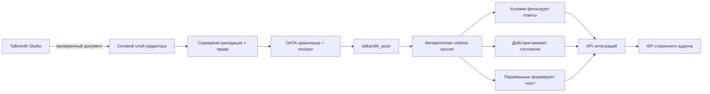
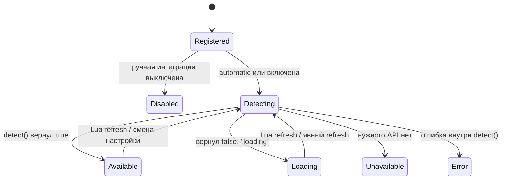

# Руководство разработчика Talksmith

> Архитектура, работа runtime, точки расширения и создание интеграций для Talksmith 2.0.0.

[English version](developer-guide.en.md) · Версия API: `2.0.0` · API интеграций: `1` · Схема диалогов: `3`

## 1. Что такое Talksmith

Talksmith - серверно-авторитетная система NPC-диалогов для Garry's Mod. Авторы создают графы диалогов в Talksmith Studio, назначают граф сущности `talksmith_actor` и расширяют логику через зарегистрированные условия, действия, переменные и providers.

Главный принцип архитектуры:

> Документ диалога хранит идентификаторы и скалярные параметры, но не исполняемый Lua-код. Сервер находит обработчики в доверенных реестрах и повторно проверяет каждый выбор перед выполнением.

Благодаря этому Studio работает с удобной моделью данных, а награды, инвентарь, права и автоматизация мира остаются под контролем сервера.

## 2. Архитектура в одном представлении



### Ответственность модулей

| Область | Ответственность |
| --- | --- |
| `Talksmith.Dialogues` | Схема, реестр, импорт/экспорт, revisions и сохранение диалогов |
| `Talksmith.Validation` | Проверка документов и параметров |
| `Talksmith.Runtime` | Сессии, переходы, видимые ответы, действия и завершение |
| `Talksmith.Actors` | Создание, внешний вид, сохранение и назначение диалогов |
| `Talksmith.Actions` | Реестр доверенных серверных действий |
| `Talksmith.Conditions` | Реестр доверенных серверных условий |
| `Talksmith.Integrations` | Манифесты, доступность, переменные и lifecycle интеграций |
| `Talksmith.Providers` | Общие адаптеры инвентаря и валют |
| `Talksmith.Editor` | Studio, граф, preview, валидация и настройки |
| `Talksmith.Permissions` | Права на редактирование, публикацию, Actor, настройки и действия |
| `Talksmith.Logging` | Серверная диагностика и необязательный вывод в Ultimate Logs |
| `Talksmith.Utils` | Безопасные ID, UTF-8-ограничения текста, проверки карт/моделей и защищённые вызовы |

## 3. Структура исходников и загрузка

Точка входа аддона:

```text
talksmith_dialogue_addon_dev_name/lua/autorun/talksmith_init.lua
```

Она создаёт единое глобальное пространство имён `Talksmith`, задаёт версии API и загружает модули тремя группами:

| Группа | Где выполняется | Содержимое |
| --- | --- | --- |
| Shared | Сервер и клиент | config, schema, validation, registries, i18n, объявления API |
| Server | Только сервер | storage, permissions, sessions, Actors, network handlers, integrations |
| Client | Только клиент | runtime HUD, Studio, настройки, preview, editor networking |

Внутри модулей аддона используется `local TS = Talksmith`. Сторонняя интеграция должна проверить `Talksmith.API.IntegrationVersion` до регистрации.

## 4. Жизненный цикл диалога

### Создание и публикация

1. Studio создаёт или открывает документ-граф.
2. Клиентский валидатор сразу показывает структурные проблемы.
3. При сохранении клиент отправляет документ и ожидаемый revision на сервер.
4. Сервер повторно валидирует документ, проверяет право публикации каждого используемого действия и ожидаемый revision.
5. Успешное сохранение увеличивает revision, обновляет реестр, записывает JSON и обновляет Actor, использующие этот диалог.

Revisions реализуют optimistic concurrency: редактор не может незаметно перезаписать более новую серверную версию.

### Разговор во время игры

1. Игрок взаимодействует с `talksmith_actor`.
2. Сервер проверяет Actor, расстояние, видимость, документ и ограничения сессий.
3. Сервер создаёт сессию и выполняет действия входного узла.
4. Условия проверяются на сервере; клиент получает только прошедшие проверку ответы.
5. Переменные вычисляются на сервере для текущего игрока и сессии.
6. Клиент показывает узел и возвращает только выбранный видимый ответ и токен сессии.
7. Сервер снова проверяет токен, Actor, revision документа, расстояние, видимость и условия.
8. Выполняются действия ответа, после чего сессия переходит к следующему узлу, открывает другой диалог или завершается.

Клиент не передаёт произвольный ID действия, результат условия, ID предмета или размер награды в момент выбора.

## 5. Модель документа диалога

Текущая схема - `Talksmith.Dialogues.Schema == 3`. Документ содержит метаданные, настройки Actor/runtime, стартовый узел и таблицу узлов.

```json
{
  "schema": 3,
  "id": "medic_intro",
  "meta": {
    "title": "Знакомство с медиком",
    "author": "Server Team",
    "revision": 4
  },
  "settings": {
    "actor_name": "Доктор Морган",
    "actor_subtitle": "Полевой медик",
    "actor_model": "models/Humans/Group03/male_07.mdl",
    "interact_distance": 180,
    "theme": "default"
  },
  "start": "greeting",
  "nodes": {
    "greeting": {
      "text": "Добро пожаловать.",
      "sound": "",
      "gesture": "",
      "actions": [],
      "editor": { "x": 180, "y": 160 },
      "options": [
        {
          "text": "Спасибо, до свидания.",
          "next": null,
          "next_random": [],
          "conditions": [],
          "actions": []
        }
      ]
    }
  }
}
```

Это сокращённое представление структуры, а не полный набор настроек Studio. Для программного создания берите документ из фабрики схемы, а не собирайте defaults вручную:

```lua
local doc = Talksmith.Dialogues.New("medic_intro")
doc.meta.title = "Знакомство с медиком"
doc.settings.actor_name = "Доктор Морган"
doc.nodes.greeting.text = "Добро пожаловать."

local ok, savedOrReason, issues = Talksmith.Dialogues.Register(
    doc.id,
    doc,
    "My Addon",
    0
)
```

`Talksmith.Dialogues.Register` валидирует документ до сохранения. При замене существующего документа передавайте его текущий revision в `expected`.

### Важные лимиты

Значения по умолчанию в текущей версии:

| Ограничение | Значение |
| --- | ---: |
| Узлов в документе | `256` |
| Ответов в узле | `6` |
| Размер JSON-документа | `524288` байт |
| Действий в последовательности | `16` |
| Условий в последовательности | `32` |
| Общая стоимость действий | `64` |
| Тайм-аут неактивной сессии | `90` секунд |
| Максимальная длительность сессии | `600` секунд |

Это конфигурация, а не вечные константы протокола.

## 6. Хранение данных

Talksmith использует Garry's Mod `DATA`, а не SQL.

| Данные | Путь внутри `garrysmod/data` |
| --- | --- |
| Опубликованные диалоги | `talksmith/dialogues/<id>.json` |
| Исторические копии диалогов | `talksmith/backups/<id>/*.json` |
| Постоянная расстановка Actor | `talksmith/actors/<map>.json` |
| Флаги игроков | `talksmith/flags/<steamid64>.json` |
| Журнал последовательностей действий | `talksmith/action_journal/<steamid64>.json` |
| Серверные настройки | `talksmith/settings.json` |
| Клиентские настройки Studio | `talksmith/editor_settings.json` |
| Клиентский экспорт | `talksmith/exports/<id>.json` |

Интеграция не должна напрямую изменять эти файлы. Используйте публичные реестры Talksmith и API хранения самого стороннего аддона.

## 7. Краткий справочник публичного API

### Версия и диалоги

```lua
Talksmith.API.GetVersion()
Talksmith.API.IntegrationVersion

Talksmith.Dialogues.Get(id)
Talksmith.Dialogues.Exists(id)
Talksmith.Dialogues.New(id, author)
Talksmith.Dialogues.Validate(doc)
Talksmith.Dialogues.Export(id, pretty)
Talksmith.Dialogues.Register(id, doc, author, expectedRevision)
Talksmith.Dialogues.Import(jsonOrTable, author, expectedRevision)
```

Валидация возвращает `ok, issues`. Register/import возвращают успех и результат либо причину; для невалидного документа также возвращается список проблем.

### Actor, заданные кодом

```lua
local actor, reason = Talksmith.Actors.Create({
    code_key = "city_medic",
    dialogue = "medic_intro",
    map = { "rp_downtown_v4c_v2", "rp_downtown_tits_v2" },
    model = "models/Humans/Group03/male_07.mdl",
    pos = Vector(124, -640, 16),
    ang = Angle(0, 90, 0),
})
```

`map` принимает имя карты, список или `"*"`. Actor, созданный кодом, не записывается в сохранённую расстановку карты. Talksmith поддерживает один Actor на диалог: создание второго с тем же диалогом заменит предыдущий.

Другие функции Actor:

```lua
Talksmith.Actors.Update(actor, data)
Talksmith.Actors.SetDialogue(actor, dialogueID)
Talksmith.Actors.Remove(actor)
Talksmith.Actors.GetDialogue(actor)
```

## 8. Модель интеграций

Интеграция может предоставить четыре типа возможностей:

| Возможность | Назначение | Пример |
| --- | --- | --- |
| Condition | Прочитать состояние и показать/скрыть ответ | у игрока не менее 10 репутации |
| Action | Изменить серверное состояние после входа/выбора | выдать 5 репутации |
| Variable | Вставить серверные данные в текст | `{myreputation.value}` |
| Provider | Реализовать общий контракт адаптера | backend инвентаря или валюты |

Код интеграции выполняется на сервере и регистрирует доверенные callbacks. JSON диалога хранит только namespaced ID вроде `myreputation.add` и скалярные параметры вроде `{ "amount": 5 }`.

### Lifecycle и статусы



Ручные интеграции по умолчанию выключены. Администратор включает их в **Talksmith Studio → Настройки → Интеграции**. Выбор хранится в `data/talksmith/settings.json`; для изменения требуется право `talksmith.integrations.manage`.

Сервер сразу рассылает обновлённый статус и каталог редактора, поэтому уже открытые окна Studio обновляются без переподключения.

Регистрация намеренно отделена от доступности. Определения остаются в каталоге даже при выключенной интеграции, поэтому ссылки в существующих диалогах не теряются; обработчики возвращают `false`, пока интеграция недоступна.

Hooks статуса:

```lua
hook.Add("Talksmith.IntegrationStatusChanged", "Example", function(id, status, reason) end)
hook.Add("Talksmith.IntegrationLoaded", "Example", function(id, manifest) end)
hook.Add("Talksmith.IntegrationsReady", "Example", function(registry) end)
```

## 9. Встроенные интеграции

| Внутренний ID | Отображаемый аддон | Основные возможности |
| --- | --- | --- |
| `pointshop` | PointShop 1 | очки, предметы, экипировка, магазин |
| `finventory` | Finventory | инвентарь, вместимость, правила запрещённых предметов |
| `gws` | GWS Inventory System | инвентарь, оружие, патроны, whitelist |
| `barney` | Barney Inventory 2.0 | инвентарь, вес, патроны |
| `darkrp_leveling` | DarkRP Leveling System | уровни и опыт |
| `darkrp_multicharacter` | DarkRP Multi Character | активный персонаж, личность, профессия |
| `advanced_character_creator` | Advanced Character Creator 1.5.5+ | личность, профессия, фракция |
| `stormfox2` | StormFox 2 | погода, время, температура |
| `ulib` | ULib | UCL-права и группы |
| `ulx` | ULX | доступ к командам и права редактора |
| `sadmin` | sAdmin | права и группы |
| `wiremod` | Wiremod | входы/выходы Actor, сигналы, автоматизация карты |

Ultimate Logs - backend журналирования, который определяется серверными настройками, а не диалоговая интеграция.

## 10. Создание интеграции

### 10.1 Расположение файла

Храните адаптер рядом с аддоном, который он интегрирует. Обычный путь:

```text
my_addon/lua/autorun/server/my_addon_talksmith.lua
```

Не изменяйте core-файлы Talksmith. Отдельный файл упрощает обновления и ясно показывает владельца интеграции.

### 10.2 Полный пример

Ниже адаптирован вымышленный серверный API `MyReputation`. Файл можно загрузить до или после Talksmith; при Lua refresh регистрация выполняется повторно.

```lua
if not SERVER then return end

local INTEGRATION_ID = "myreputation"
local HOOK_ID = "MyReputation.Talksmith"

local function registerIntegration()
    local TS = Talksmith
    if not TS or not TS.API or TS.API.IntegrationVersion ~= 1 then
        return
    end

    local API = TS.API.Integrations

    API.Register(INTEGRATION_ID, {
        name = "My Reputation",
        version = "1.0",
        category = "progression",
        capabilities = { "reputation" },
        automatic = false,
        detect = function()
            local addon = MyReputation
            return istable(addon)
                and isfunction(addon.Get)
                and isfunction(addon.Add)
        end,
    })

    API.RegisterCondition(INTEGRATION_ID, "at_least", {
        name = "My Reputation: at least",
        description = "Checks the player's current reputation.",
        params = {
            amount = {
                type = "number",
                required = true,
                integer = true,
                min = 0,
                max = 1000000,
            },
        },
        run = function(context, params)
            local value = tonumber(MyReputation.Get(context.player)) or 0
            return value >= params.amount
        end,
    })

    API.RegisterAction(INTEGRATION_ID, "add", {
        name = "My Reputation: add",
        description = "Adds reputation to the player.",
        permission = "talksmith.actions.progression",
        cost_param = "amount",
        params = {
            amount = {
                type = "number",
                required = true,
                integer = true,
                min = 1,
                max = 64,
            },
        },
        preflight = function(context)
            return IsValid(context.player)
        end,
        run = function(context, params)
            return MyReputation.Add(context.player, params.amount) ~= false
        end,
    })

    API.RegisterVariable("myreputation.value", {
        integration = INTEGRATION_ID,
        name = "Current reputation",
        resolve = function(context)
            return tonumber(MyReputation.Get(context.player)) or 0
        end,
    })

    if TS.Integrations.Refresh then
        TS.Integrations.Refresh(INTEGRATION_ID)
    end
    return true
end

if not registerIntegration() then
    hook.Add("Initialize", HOOK_ID, function()
        if registerIntegration() then
            hook.Remove("Initialize", HOOK_ID)
        end
    end)
end
hook.Add("OnReloaded", HOOK_ID, function()
    timer.Simple(0, registerIntegration)
end)
```

После установки файла:

1. Перезапустите сервер или выполните Lua refresh.
2. Включите **My Reputation** в настройках Studio.
3. Добавьте `myreputation.at_least` в условия ответа.
4. Добавьте `myreputation.add` в его действия.
5. Используйте `{myreputation.value}` в тексте узла или ответа.

В документе это хранится так:

```json
{
  "conditions": [
    { "id": "myreputation.at_least", "params": { "amount": 10 } }
  ],
  "actions": [
    { "id": "myreputation.add", "params": { "amount": 5 } }
  ]
}
```

### 10.3 Поля манифеста

| Поле | Обязательность | Назначение |
| --- | --- | --- |
| `name` | Рекомендуется | Понятное название в Studio |
| `version` | Нет | Версия адаптера или целевого API |
| `category` | Нет | Группа Studio: `inventory`, `economy`, `progression`, `world`, `permissions`, `character` или `automation` |
| `capabilities` | Нет | Описательный список возможностей каталога |
| `automatic` | Нет | При `true` не требует ручного включения; для gameplay-интеграций оставляйте `false` |
| `detect` | Рекомендуется | Строгая серверная проверка совместимости |
| `priority` | Нет | Метаданные; не разрешает неоднозначность между несколькими providers |

Хороший detector проверяет именно те функции, которые вызывает адаптер. Проверка одного общего global может признать несовместимую версию доступной и перенести ошибку в живой игровой процесс.

### 10.4 Схемы параметров

Допускаются только скалярные значения: boolean, конечное number или string. Неизвестные поля и таблицы отклоняются.

```lua
params = {
    enabled = { type = "boolean", required = true },
    amount = { type = "number", required = true, integer = true, min = 1, max = 64 },
    mode = { type = "string", required = true, options = { "add", "remove" } },
    item = { type = "string", required = true, max = 128 },
}
```

| Правило | Для чего | Значение |
| --- | --- | --- |
| `type` | все | `boolean`, `number` или `string` |
| `required` | все | значение обязательно |
| `min`, `max` | числа | включительные числовые границы |
| `integer` | числа | запрещает дробные значения |
| `max` | строки | максимальная длина в байтах в валидаторе параметров |
| `options` | скаляры | точный allowlist; элементы могут быть значениями или записями `{ value = ... }` |

Используйте узкие лимиты. Схема нужна Studio и повторно проверяется сервером при публикации и выполнении.

### 10.5 Безопасность и выполнение действий

Каждое действие должно иметь классификацию:

| Классификация | Когда использовать |
| --- | --- |
| `safe = true` | Не требует отдельного права action при публикации; используйте только для намеренно общедоступных действий |
| `permission = "<известное право Talksmith>"` | Требует указанное право action при публикации и имеет приоритет над dangerous |
| `dangerous = true` | Требует `talksmith.actions.dangerous`, если не указано известное permission |

Известные права: `talksmith.actions.economy`, `talksmith.actions.inventory`, `talksmith.actions.progression`, `talksmith.actions.jobs`, `talksmith.actions.events`, `talksmith.actions.dangerous` и `talksmith.wire.manage`. Действие без `safe`, `dangerous` или permission автоматически считается опасным.

Порядок выполнения последовательности:

1. Проверяются все ID и параметры.
2. Рассчитывается общая стоимость действий.
3. Все `preflight` выполняются до первой мутации.
4. При необходимости запускается fail-closed журнал действий.
5. Действия выполняются по порядку, их состояния записываются.
6. Ошибка, rejection или timeout останавливают последовательность.

Верните `false` или `{ success = false }` для ошибки. Promise-подобная таблица с методом `Then` ожидается до 15 секунд.

Общего callback `rollback` нет. Если одно действие делает несколько изменений, компенсацию частичного результата нужно выполнить внутри этого действия до возврата ошибки. Через `preflight` заранее проверяйте баланс, место в инвентаре, валидность сущностей и доступность состояния.

### 10.6 Context обработчиков

Основные поля:

```lua
context.player
context.actor
context.session
context.dialogue_id
context.node_id
context.action_scope
context.option_index
```

`option_index` присутствует у действий ответа. Не храните session-table как постоянное состояние: проверяйте живые сущности и запрашивайте авторитетный API целевого аддона непосредственно в callback.

## 11. Переменные

Синтаксис переменных: `{id}` или `{id:argument}`.

```text
Репутация: {myreputation.value}
Аптечки: {inventory.item_count:item_healthkit}
Погода: {stormfox2.weather}
```

Resolvers выполняются на сервере с context текущего диалога. Аргумент ограничивается по длине, результат преобразуется в текст и также ограничивается. Недоступная переменная остаётся видимым placeholder. Ошибка resolver или результат `nil` превращаются в пустую строку.

Переменные должны только читать состояние. Никогда не выдавайте предмет, не снимайте деньги и не изменяйте персонажа из `resolve`.

## 12. Универсальные providers

Provider позволяет интеграции предоставить общий backend-контракт. Встроенные типы: inventory, currency, progression, character, world и permissions. Универсальные dialogue actions поставляются для inventory и currency.

### Контракт инвентаря

```lua
Talksmith.API.Integrations.RegisterProvider("inventory", "myinventory", {
    name = "My Inventory",
    integration = "myinventory",

    get_item_count = function(self, player, itemID)
        return MyInventory.Count(player, itemID)
    end,

    can_receive = function(self, player, itemID, amount)
        return MyInventory.CanReceive(player, itemID, amount)
    end,

    give_item = function(self, player, itemID, amount)
        return MyInventory.Give(player, itemID, amount)
    end,

    take_item = function(self, player, itemID, amount)
        return MyInventory.Take(player, itemID, amount)
    end,

    open = function(self, player)
        MyInventory.Open(player)
        return true
    end,
})
```

Общие ID:

```text
inventory.has_item
inventory.has_space
inventory.give_item
inventory.take_item
inventory.open
inventory.item_count

currency.has_amount
currency.add
currency.take
```

### Правило выбора provider

`provider = "auto"` или пустое значение выбирает backend только тогда, когда нужный метод поддерживает ровно один доступный provider. Если подходят два или больше, Talksmith не выбирает ни один, а Studio требует явное значение.

```json
{
  "id": "inventory.give_item",
  "params": {
    "provider": "myinventory",
    "item": "item_healthkit",
    "amount": 1
  }
}
```

`priority` хранится как метаданные, но не выбирает победителя. Благодаря этому установка второго инвентаря не перенаправит награды незаметно.

Адаптеры инвентарей с сущностями должны применять и нативные правила целевого аддона, и allowlist Talksmith. Никогда не передавайте текст из документа напрямую в `ents.Create`.

## 13. Полезные hooks

### Сервер

| Hook | Аргументы | Назначение |
| --- | --- | --- |
| `Talksmith.CanStartDialogue` | `player, actor, dialogueID` | Верните `false`, чтобы запретить старт |
| `Talksmith.DialogueStartRejected` | `player, actor, dialogueID, reason` | Наблюдение за отклонением из-за занятой сессии |
| `Talksmith.DialogueStarted` | `player, actor, dialogueID` | Сессия запущена |
| `Talksmith.NodeEntered` | `player, actor, dialogueID, nodeID` | Выполнен вход в узел |
| `Talksmith.OptionSelected` | `player, actor, visibleIndex` | Валидный ответ принят |
| `Talksmith.ActionExecuted` | `player, actionID` | Действие успешно завершено |
| `Talksmith.DialogueEnded` | `player, actor, reason` | Сессия завершена |
| `Talksmith.DialogueSaved` | `dialogueID, revision, author` | Документ опубликован |
| `Talksmith.DialogueDeleted` | `dialogueID` | Документ удалён |
| `Talksmith.ActorCreated` | `actor, data` | Actor создан |
| `Talksmith.Event` | `event, player, actor, data` | Встроенное event-действие вызвано |
| `Talksmith.IntegrationStatusChanged` | `id, status, reason` | Status интеграции обновлён |
| `Talksmith.IntegrationLoaded` | `id, manifest` | Интеграция стала available |
| `Talksmith.IntegrationsReady` | `registry` | Первичная проверка интеграций завершена |
| `Talksmith.IntegrationSettingChanged` | `id, enabled, status, reason` | Настройка интеграции сохранена |
| `Talksmith.ConfigChanged` | `key, value, previous` | Настройка Config сохранена |
| `Talksmith.PermissionSettingChanged` | `right, groups, actor` | Группы permission сохранены |
| `Talksmith.AdminGroupsChanged` | `backend` | Список admin groups изменился |

### Клиент

| Hook | Аргументы | Назначение |
| --- | --- | --- |
| `Talksmith.ClientNodeShown` | `data` | Получен runtime payload узла |
| `Talksmith.ClientOptionSelected` | `index, data` | Локально выбран ответ |
| `Talksmith.ClientStateChanged` | `previous, current, data` | Изменилось состояние runtime UI |
| `Talksmith.ClientAudioStarted` | `url, data` | Запущено удалённое аудио узла |
| `Talksmith.ClientAudioError` | `url, errorID, errorName, data` | Ошибка удалённого аудио |
| `Talksmith.RuntimeSettingsChanged` | `speed, showName, showDescription, showInteraction` | Runtime settings обновлены |
| `Talksmith.EditorCatalogChanged` | нет | Server catalog обновлён |
| `Talksmith.EditorSettingChanged` | `key, value` | Локальная настройка Studio изменена |
| `Talksmith.ExampleDraftAdded` | `id, document, exampleID` | Добавлен draft примера |

Клиентские hooks - сигналы представления, а не источник истины. Не выдавайте через них награды.

## 14. Checklist безопасности и качества

Перед выпуском интеграции проверьте:

- [ ] Файл выполняется только на сервере.
- [ ] Проверяется `IntegrationVersion == 1`.
- [ ] ID интеграции и все локальные ID стабильны и namespaced.
- [ ] `detect` проверяет каждую API-функцию, используемую callbacks.
- [ ] Ручное включение остаётся default для gameplay-интеграции.
- [ ] Параметры скалярны, ограничены и при необходимости повторно проверяются целевым аддоном.
- [ ] У каждого действия есть `safe`, `permission` или `dangerous`.
- [ ] Все действия возвращают явный результат успеха/ошибки.
- [ ] `preflight` проверяет место, баланс, владение и сущности до мутаций.
- [ ] Многошаговая мутация компенсирует частичный результат локально.
- [ ] ID entity-предметов проходят нативную политику и allowlist Talksmith.
- [ ] Conditions и variables не изменяют состояние.
- [ ] Клиентское значение не обходит зарегистрированную схему параметров.
- [ ] ID регистрации не принадлежит другому source-файлу.
- [ ] Состояния disabled, unavailable и missing addon завершаются безопасно.
- [ ] Provider проверен как единственный и при наличии нескольких providers.
- [ ] Существующие ссылки диалогов переживают disable/enable и Lua refresh.

## 15. Диагностика

| Статус или симптом | Значение | Что проверить |
| --- | --- | --- |
| `disabled` | Зарегистрирована, но выключена | Studio → Настройки → Интеграции и право `talksmith.integrations.manage` |
| `unavailable` | Включена, detector вернул false | Версию аддона, globals, методы, порядок загрузки |
| `loading` | Detector вернул `false, "loading"` | Refresh после завершения загрузки целевого аддона |
| `error` | Detector выбросил ошибку | Серверный лог и реализацию detector |
| Действия нет в Studio | Definition не зарегистрирован или catalog не обновился | ID, серверные ошибки, Lua refresh, момент регистрации |
| Действие видно, но оно падает | Интеграция недоступна, params/preflight/callback завершились ошибкой | Статус интеграции и серверный лог |
| Общий provider не работает | Нет подходящих или их несколько | Выбрать явный ID `provider` |
| Диалог не сохраняется | Validation, permission или revision conflict | Problems, серверные права, последнюю revision |
| Переменная остаётся `{id}` | Неизвестная или недоступная переменная | ID регистрации и статус интеграции |

## 16. Правила совместимости

Считайте эти идентификаторы постоянным контрактом данных:

- ID интеграции, например `myreputation`;
- ID actions и conditions, например `myreputation.add`;
- ID variables, например `myreputation.value`;
- ID providers, например `myinventory`;
- имена и смысл параметров.

Отображаемое название менять безопасно. Переименование ID ломает ссылки в сохранённых диалогах, если не оставить совместимую регистрацию старого ID. Новые необязательные параметры добавляйте совместимо; не меняйте скрытно смысл или единицу существующего параметра.

После изменения `IntegrationVersion` адаптер нужно сверить с новым контрактом до регистрации.

---

Финальным источником истины остаётся реализация в `lua/talksmith/integrations/`.
